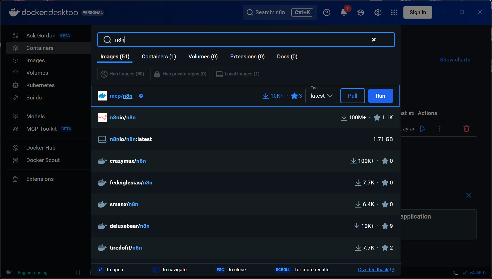

# 🤖 n8n-agents

A collection of **ready-to-use AI agents and automations built with n8n**. This repository contains JSON workflow files that you can directly import into n8n to spin up intelligent agents such as data analysts, sales analysts, and more.

The goal of this repo is to help you **quickly deploy AI-powered automations using Docker + n8n**, with minimal setup.

---

## 📦 What’s Inside

* 📁 **n8n workflow JSON files**

  * Preconfigured AI agents
  * Tool-integrated automations (Google Sheets, APIs, etc.)
* 📄 **Documentation** to help you get started

Each JSON file represents a complete n8n automation that can be imported directly.

---

## 🛠 Prerequisites

Before you begin, make sure you have:

* A system with **Docker** installed
* Basic familiarity with n8n (helpful, but not required)

---

## 🐳 Installing Docker

### 🔹 Windows / macOS

1. Download **Docker Desktop**:

   * [https://www.docker.com/products/docker-desktop/](https://www.docker.com/products/docker-desktop/)
2. Install and start Docker Desktop
3. Verify installation:

```bash
docker --version
```

---

### 🔹 Linux (Ubuntu example)

```bash
sudo apt update
sudo apt install -y docker.io
sudo systemctl start docker
sudo systemctl enable docker
```

Verify:

```bash
docker --version
```

---

## 🚀 Running n8n Using Docker

You can run n8n either via **Docker Desktop (UI)** or **Docker CLI**.

---

## 🖥️ Option A: Run n8n Using Docker Desktop (UI)

This is the easiest method if you prefer a graphical interface.

### 1️⃣ Open Docker Desktop

* Make sure Docker Desktop is **running**
* Go to the **Images** tab

### 2️⃣ Search for the Official n8n Image

* In the search bar, type:

```
n8nio/n8n
```

* Select the **official image**: `n8nio/n8n`



### 3️⃣ Pull the Image

* Click **Pull** to download the image

### 4️⃣ Run the Container

* Click **Run**
* Set the following options:

  * **Port mapping**: `5678` → `5678`
  * (Optional) Volume: map a local folder to `/home/node/.n8n` for persistence

### 5️⃣ Open n8n in Browser

Once the container is running, open:

```
http://localhost:5678
```

You should now see the n8n editor 🎉

---

## 💻 Option B: Run n8n Using Docker CLI

If you prefer the terminal:

```bash
docker run -it --rm \
  -p 5678:5678 \
  -v ~/.n8n:/home/node/.n8n \
  n8nio/n8n
```

### Open n8n in Browser

```
http://localhost:5678
```

Your n8n editor should now be running 🎉

---

## 📥 Importing n8n Automation JSON Files

You can import any workflow from this repository directly into n8n.

### ✅ Method: Copy–Paste JSON (Recommended)

1. Open **n8n Editor** in your browser
2. Click **☰ Menu (top-right)**
3. Select **Import workflow**
4. Choose **Paste JSON**
5. Copy the workflow JSON file from this repo
6. Paste it into the editor and click **Import**

That’s it! The automation will appear in your workspace.

---

## 🔑 Credentials Setup

After importing a workflow, you may need to configure credentials:

* OpenRouter / OpenAI / LLM APIs
* Google OAuth
* Any third-party services used in the workflow

n8n will automatically highlight missing credentials.

---

## 🧠 Using AI Agent Workflows

Once imported:

1. Open the workflow
2. Review the **AI Agent** node
3. Update system prompts if needed
4. Attach your credentials
5. Click **Activate** or **Execute Workflow**

You can now interact with the agent via:

* Chat Trigger
* Webhook
* Scheduled runs (if configured)

---

## 🧩 Folder Structure (Suggested)

```
n8n-agents/
│
│─ yt-shorts-agent/
│ ├── yt-shorts-agent.json
│ └── README.md
│
│─ sales-data-analyst/
│ ├── sales-data-analyst.json
│ └── README.md
│
│─ marketing-agent/
│ ├── marketing-agent.json
│ └── README.md
│
│─ data-analyst-agent/
│ ├── data-analyst-agent.json
│ └── README.md
│
└── README.md
```

---

## 🛡️ Best Practices

* Always review imported workflows before activation
* Never hardcode API keys in JSON files
* Use environment variables where possible
* Keep Docker volumes backed up (`~/.n8n`)

---

## 🌱 Future Plans

* More AI agent templates
* Multi-agent workflows
* Vector database integrations
* CRM & BI tool automations

---

## 📄 License

MIT License

---

## 🙌 Contributing

Contributions are welcome!

* Fork the repo
* Add new n8n agent workflows
* Submit a pull request 🚀

---

## ⭐ Support

If this repo helped you:

* Star ⭐ the repository
* Share with the n8n community

Happy automating! 🤖
